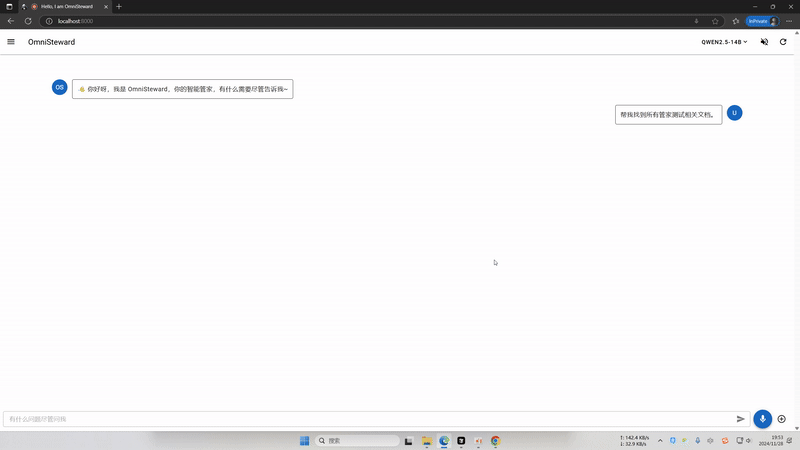

# OmniSteward

[中文文档](README_zh.md)

**Note: This project is still under active development, and some features may be unstable, please use with caution**

**The English README is automatically generated, please refer to the Chinese version for the most accurate information**

This is an AI-powered steward system based on large language models that can interact with users through voice or text to help control smart home devices and computer programs.



## Highlights

- Supports multi-turn dialogue for continuous user interaction
- Supports tool calling to execute complex tasks on your computer
- Supports multiple LLM models that can be switched as needed
- Highly extensible - you can easily customize and share your own tools

## Main Features

- 🎤 Voice recognition and interaction
- 🏠 Smart home control (Bemfa devices)
- 💻 Computer program management (start/stop programs)
- 🔍 Online information retrieval (via Kimi AI)
- ⌨️ Command line operations

## Demo Video

We prepared a series of demo videos, please watch [demo videos](https://youtube.com/playlist?list=PLB-gnx_vrV9nFWHbZbxfktOPmHv7llkQZ&si=ZcZVOO6mfteR120a) to understand the main features and usage of the system.


## System Requirements

- Python 3.8+
- Chrome browser (for Kimi AI functionality)
- Windows OS (some features only support Windows, Linux and Mac untested)

## Installation

1. Clone repository
```bash
git clone https://github.com/OmniSteward/OmniSteward.git
cd OmniSteward
```

2. Install dependencies
```bash
pip install -r requirements.txt
```

## Environment Variables Configuration
See [examples/env.cmd](examples/env.cmd) file
```
SILICON_FLOW_API_KEY=your_api_key   # Silicon Flow API key for ASR, ReRank, LLM inference services
BEMFA_UID=your_bemfa_uid            # Bemfa platform UID (optional, for smart home control)
BEMFA_TOPIC=your_bemfa_topic        # Bemfa platform Topic (optional, for smart home control)
KIMI_PROFILE_PATH=path_to_chrome_profile    # Chrome user data directory (optional, for Kimi AI, uses default path if not set)
LOCATION=your_location                     # Your geographic location (optional, for system prompts)
```
Reference links:
- [Silicon Flow Official](https://siliconflow.cn/zh-cn/siliconcloud)
- [Bemfa Official](https://bemfa.com/)
- [Kimi AI Official](https://kimi.moonshot.cn/)

## Launch

This project supports two usage modes:
- Command Line Interface (CLI): Interact through command line, direct usage.
- Web Mode: Requires frontend project, interact through WebUI, can be used remotely on phone, tablet, computer to manage smart home devices

### Command Line Mode (CLI)

Please first configure environment variables in `examples/env.cmd` file (see [Environment Variables Configuration](#environment-variables-configuration))

#### Microphone Voice Input Mode

First start the VAD service:
```cmd
python -m servers.vad_rpc
```

Then open a new command prompt window and run:
```cmd
call examples\env.cmd # Apply environment variables
python -m core.cli --config configs/cli.py # Run CLI
```
See [examples/cli_voice.cmd](examples/cli_voice.cmd) for more details

#### Text Input Mode

```cmd
call examples\env.cmd # Apply environment variables
python -m core.cli --query "open NetEase Music" --config configs/cli.py
```

#### Adding Simple Custom Tools
```cmd
call examples\env.cmd # Apply environment variables
python -m core.cli --query "print hello" --config configs/cli_custom_tool.py
```
This example adds a simple print tool in [configs/cli_custom_tool.py](configs/cli_custom_tool.py) that can print any string. Check this file to learn how to easily add custom tools

### Web Mode

- Requires frontend WebUI, called [OmniSteward-Frontend](https://github.com/OmniSteward/OmniSteward-Frontend)
- Environment variables must be configured, especially Silicon Flow API key
- Frontend WebUI should run on `http://localhost:3000`, backend will forward requests to frontend when started
- Backend service should run on `http://localhost:8000`

#### Start Backend Service

Please first configure environment variables in `examples/env.cmd` file (see [Environment Variables Configuration](#environment-variables-configuration)), then run in project root:
```cmd
call examples\env.cmd # Apply environment variables
python -m servers.steward --config configs/backend.py
```

#### Start Frontend Service

See [OmniSteward-Frontend](https://github.com/OmniSteward/OmniSteward-Frontend) project.

#### Usage
Use Chrome/Edge browser, open `http://localhost:8000` to start using.

Note: For external network access, since Chrome/Edge blocks microphone under HTTP by default, we need to set `chrome://flags/#unsafely-treat-insecure-origin-as-secure` to `http://ip:port`, otherwise it cannot be used. See [tutorial](https://blog.csdn.net/zwj1030711290/article/details/125425877) for reference.

Mobile phones can also use Chrome or Edge browser, open `http://ip:port` to start using, requires same settings as above.

## Available Tools

See [TOOL_LIST.md](docs/TOOL_LIST.md)

## Tech Stack

- Audio Processing: pyaudio, sounddevice
- AI Models: Qwen2.5, BGE Reranker, Silero VAD
- Web Services: Flask, zerorpc
- Browser Automation: Selenium
- Others: requests, beautifulsoup4

## Notes

- Some features require specific API keys and environment configuration
- Command line tools require user confirmation before execution
- Smart home control features require corresponding hardware support


## Contributing

Currently this project is maintained by [ElliottZheng](https://github.com/ElliottZheng), welcome to submit issues and pull requests!


## License

[MIT License](LICENSE)

Copyright (c) 2024-present [ElliottZheng](https://github.com/ElliottZheng)
